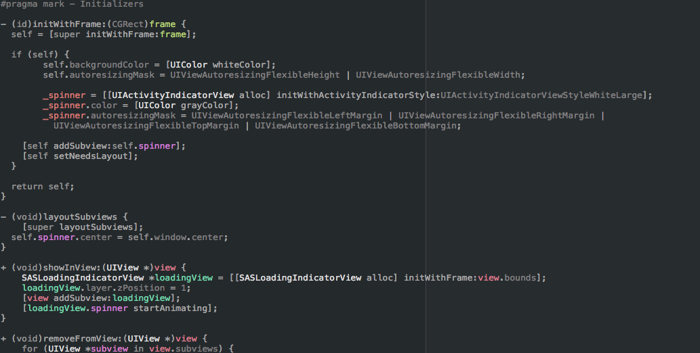
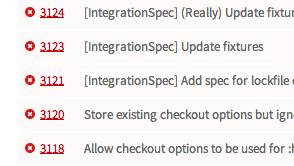
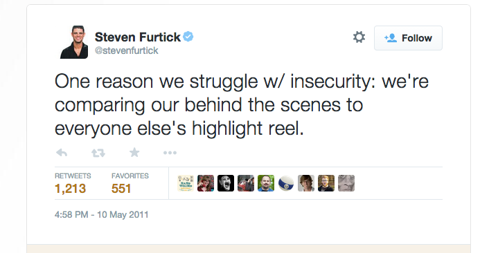

# Your brain is out to get you

### David Grandinetti
#### (imposter at large)

---

#Imposter Syndrome

---

## I have no idea what I'm doing

---

## A failure to internalize success

---

#Success = Luck
#Failure = My fault

---

## Programmers
## Academics
## Executives
## Athletes
## Parents

---

# Astronauts

---

# We may exacerbate this feeling...

---

> //FIXME: I have no idea how or why this works.
-- Every Programmer Ever

---

#Your code is fail

---

# git-blame

---

# git-praise

###https://github.com/ansman/git-praise

---

> Today I'm going to have you write `malloc()`
-- Interviewer

---

## The most effective technique to overcome impostor syndrome is to simply recognize that it exists. *[citation needed]*

---

---

#Dunning–Kruger Effect

---

> If you’re incompetent, you can’t know you’re incompetent. 

---

> …the skills you need to produce a right answer are exactly the skills you need to recognize what a right answer is.
-- David Dunning

---

##4 stages of competence
### Unconscious incompetence
### Conscious incompetence
### Conscious competence
### Unconscious competence

---

> I know that I know nothing.
-- Socrates

---

#Hanlon's razor

---

> Never attribute to malice that which is adequately explained by stupidity.

---

##Chat, Email, Pull Requests

---

Links

####[http://en.wikipedia.org/wiki/Impostor_syndrome](http://en.wikipedia.org/wiki/Impostor_syndrome)
####[https://en.wikipedia.org/wiki/Dunning-Kruger_effect](https://en.wikipedia.org/wiki/Dunning-Kruger_effect)
####[http://www.forbes.com/sites/margiewarrell/2014/04/03/impostor-syndrome/](http://www.forbes.com/sites/margiewarrell/2014/04/03/impostor-syndrome/)
####[https://github.com/ansman/git-praise](https://github.com/ansman/git-praise)
####[https://travis-ci.org/CocoaPods/CocoaPods/pull_requests](https://travis-ci.org/CocoaPods/CocoaPods/pull_requests)
####[https://twitter.com/stevenfurtick/status/67981913746444288](https://twitter.com/stevenfurtick/status/67981913746444288)

---
 
Images

####[https://pbs.twimg.com/media/Bw5Fb7wIIAAGOqv.jpg](https://pbs.twimg.com/media/Bw5Fb7wIIAAGOqv.jpg)
####[http://awesomeuniverse.org/wp-content/uploads/2013/07/Foto-Buzz-Aldrin-tirada-por-Neil-Armstrong-na-Lua.jpg](http://awesomeuniverse.org/wp-content/uploads/2013/07/Foto-Buzz-Aldrin-tirada-por-Neil-Armstrong-na-Lua.jpg)
####[https://pbs.twimg.com/media/Bwei-8gCMAAQxja.png](https://pbs.twimg.com/media/Bwei-8gCMAAQxja.png)
####[http://ericleads.com/wp-content/uploads/2012/10/whiteboard-code.jpg](http://ericleads.com/wp-content/uploads/2012/10/whiteboard-code.jpg)
####[http://nephos.files.wordpress.com/2011/12/tacky-jesus.jpg](http://nephos.files.wordpress.com/2011/12/tacky-jesus.jpg)

